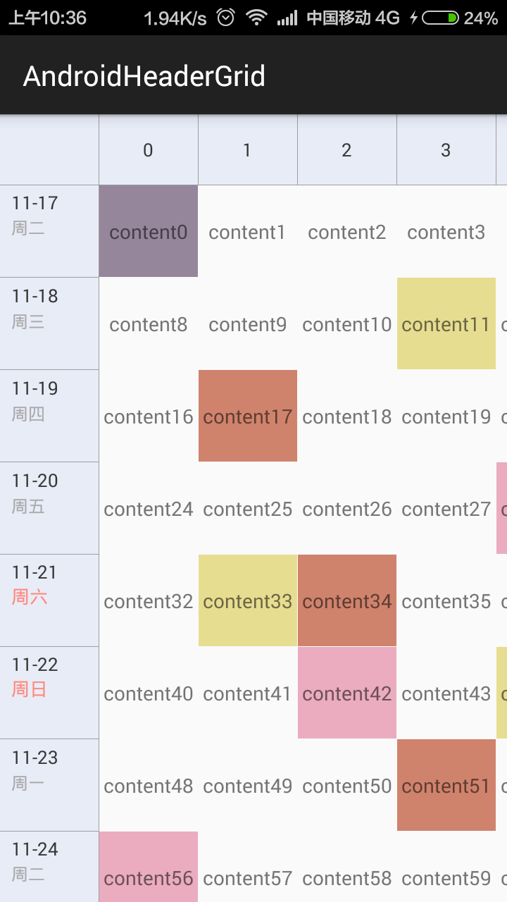

# AndroidHeaderGrid
**AndroidHeaderGrid** is a GridView with top and left header.

Features
------------
* Horizontal and vertical scrolling
* Multiselect
* Left and top header while Scrolling
* Clickable top header

Usage
---------

Well,before my modify, you can downLoad ZIP Temporarily.

~(≧▽≦)/~啦啦啦
